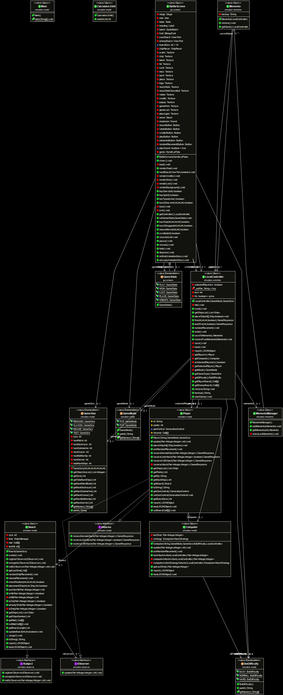

Our wiki: https://github.com/UCM-FDI-IS2-2020/proyecto-is2-grupo-10/wiki

Wiki about [BattleShip game](https://en.wikipedia.org/wiki/Battleship_(game))

[UML Diagram [Read-Only]](https://www.lucidchart.com/documents/view/df9efcbd-3f35-44a5-a2e9-91e264550881)

[State Diagram [Read-Only]](https://www.lucidchart.com/documents/view/d9eb6bc7-1395-4728-b6ab-47c6b19413e4)

Sequence Diagrams: 
- [(Client - Server) [Read-Only]](https://www.lucidchart.com/documents/view/4908f83a-4e98-4532-83ef-7d4e4ec3fa41)
- [(User - PlayGame/JUGAR) [Read-Only]](https://www.lucidchart.com/documents/view/042a3141-3fa3-44f0-96fc-55bcb640c01e/0_0)
- [(Crear Juego PvE) [Read-Only]](https://www.lucidchart.com/invitations/accept/6540ca99-5a2e-4cf6-8688-418178846ab1)
- [(Crear Juego PvP) [Read-Only]](https://www.lucidchart.com/invitations/accept/d4725848-acd5-4bbe-a61a-e2bd00bf7691)
- [(Comprar ataques y defensas) [Read-Only]](https://www.lucidchart.com/invitations/accept/c4d8a54f-830e-406f-a5ef-08c610e55e99)

[Trello [Invitation link]](https://trello.com/invite/b/ENS8vZVv/6d1925f80ca30e0fbb06ae923191ec12/hundir-la-flota)

[User Story [Read-Only]](https://docs.google.com/document/d/1pe16P_SYhUzEO59c4V8ezdHKpzLpMrv0VP4BMo_a-bQ/edit?usp=sharing)

[Documentacion de clases [Por hacer][Read-Only]](https://docs.google.com/document/d/1QWcwam9fNrB-AWJxxMlD_-rmv_vmOJEyimzL4XUsW9s/edit?usp=sharing)

---

### Beta UML Diagram

